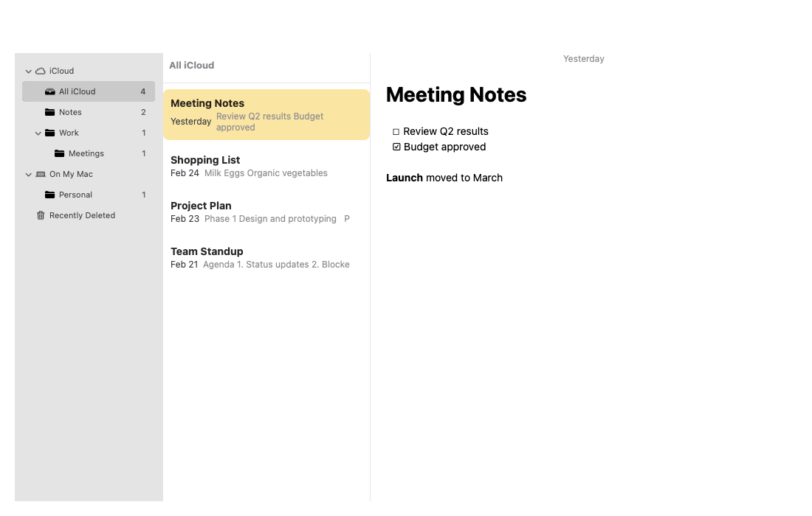
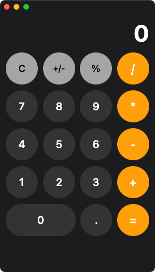
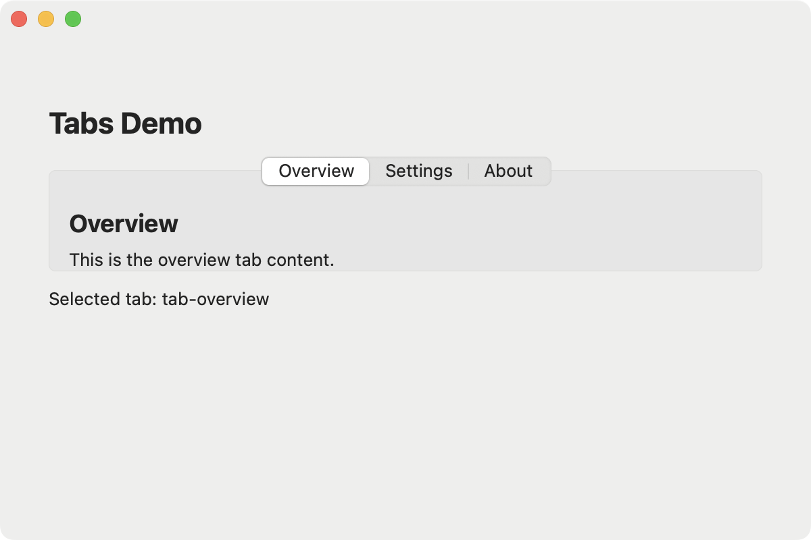

# jview

Native macOS renderer for the [A2UI](https://a2ui.org) JSONL protocol. No webview, no Electron — real AppKit widgets driven by declarative JSON. Connect to any LLM and let it build native UIs in real-time.

<p align="center">
  
</p>

<p align="center">
  
  &nbsp;&nbsp;
  
  &nbsp;&nbsp;
  
</p>

## What It Does

jview renders A2UI JSONL as native Cocoa widgets. Messages come from static files, live from an LLM, or programmatically via MCP tools — the LLM calls tools to create windows, add components, and update data, producing a native macOS UI. User interactions (button clicks, form input) flow back as conversation turns, so the LLM can update the UI in response. Native libraries can be loaded at runtime via FFI.

```
LLM / File  -->  Transport  -->  Engine (Go)  -->  CGo bridge  -->  AppKit (Obj-C)  -->  Native UI
                     ^               |                                                      |
                     |               +-- FFI (libffi) --> any native .dylib                 |
                     |--- user actions (button clicks, form data) <-------------------------+
```

## Quick Start

**Requirements:** macOS 13+, Go 1.25+

```bash
# Build
make build

# Run a static JSONL file
build/jview testdata/hello.jsonl

# Run an app directory (prefers app.jsonl or main.jsonl as entry point)
build/jview testdata/calculator_v2/

# Watch mode — auto-reload on file changes
build/jview --watch testdata/contact_form.jsonl

# LLM mode (default: anthropic / claude-opus-4-6)
ANTHROPIC_API_KEY=... build/jview --prompt "Build a todo app"

# Prompt from file
build/jview --prompt-file prompt.txt

# Different provider/model
build/jview --llm openai --model gpt-4o --prompt "Build a calculator"
build/jview --llm ollama --model llama3 --prompt-file app-spec.txt --mode raw

# Claude Code mode (spawns claude subprocess with MCP tools)
build/jview --claude-code "Build a notes app with sidebar"

# Load native libraries via FFI config
build/jview --ffi-config libs.json testdata/app.jsonl

# Run a sample app (from cache or LLM)
make run-app A=sysinfo

# Build macOS .app bundle
make app

# Run all tests
make check
```

## How It Works

A2UI JSONL defines surfaces (windows), components (widgets), and a data model (reactive state). jview processes these through a layered architecture:

```
Transport (goroutine)          <- LLM tool calls, file JSONL, or MCP
    |
engine.Session (goroutine)     <- routes messages to surfaces
    |
engine.Surface                 <- manages tree, data model, bindings
    |
Dispatcher.RunOnMain()         <- batches render ops to main thread
    |
darwin.Renderer (main thread)  <- CGo -> ObjC -> NSView creation/updates
    |
Native Cocoa widgets           <- visible on screen
```

### Transport Modes

| Mode | Flag | Description |
|------|------|-------------|
| File | `<file.jsonl>` | Read static JSONL |
| Directory | `<dir/>` | Load app directory (prefers `app.jsonl`/`main.jsonl`) |
| Watch | `--watch <path>` | File/dir mode with live reload on changes |
| LLM | `--prompt "..."` | Generate UI via LLM tool calls |
| Claude Code | `--claude-code "..."` | Spawn claude subprocess with MCP tools |
| MCP | `mcp [file]` | Dedicated MCP server mode (stdin/stdout) |

Supported LLM providers: Anthropic, OpenAI, Gemini, Ollama, DeepSeek, Groq, Mistral.

### Components (23)

| Component | Description |
|-----------|-------------|
| Text | Labels and headings (h1-h5, body, caption) |
| Row | Horizontal stack layout |
| Column | Vertical stack layout |
| Card | NSBox container with title |
| Button | Clickable button with actions |
| TextField | Text input with two-way data binding |
| CheckBox | Toggle with two-way data binding |
| Slider | Numeric range input with data binding |
| Image | Async URL image loading |
| Icon | SF Symbols (macOS 11+) |
| Divider | Visual separator |
| List | Scrollable templated list |
| Tabs | Tabbed container with data binding |
| ChoicePicker | Dropdown selection |
| DateTimeInput | Date/time picker |
| Modal | Floating dialog panel |
| Video | AVPlayerView video playback |
| AudioPlayer | Compact audio controls (play/pause, scrubber, time) |
| SplitView | Resizable multi-pane layout (NSSplitView) |
| OutlineView | Hierarchical tree sidebar with SF Symbol icons |
| SearchField | Native search input with cancel button |
| RichTextEditor | Rich text with markdown storage |
| ProgressBar | Determinate or indeterminate progress indicator |

### Reusable Abstractions

**defineFunction** — reusable parametric expressions:
```json
{"type":"defineFunction","name":"appendDigit","params":["current","digit"],
 "body":{"functionCall":{"name":"concat","args":[{"param":"current"},{"param":"digit"}]}}}
```

**defineComponent** — reusable component templates with ID rewriting and state scoping:
```json
{"type":"defineComponent","name":"DigitButton","params":["digit"],"components":[
  {"componentId":"_root","type":"Button","props":{"label":{"param":"digit"}}}
]}
```
Use with: `{"componentId":"btn7","useComponent":"DigitButton","args":{"digit":"7"}}`

**include** — split apps across files:
```json
{"type":"include","path":"defs.jsonl"}
```

**State scoping** — `$` paths isolate state per instance:
```json
{"componentId":"c1","useComponent":"Counter","scope":"/c1"}
{"componentId":"c2","useComponent":"Counter","scope":"/c2"}
```

See `testdata/calculator_v2/` for a full example using all four features.

### Component Library

Components defined via `defineComponent` are saved to `~/.jview/library/` and persist across sessions. They're automatically included in LLM system prompts so the LLM can reuse them via `useComponent`.

### Data Binding

Components bind to the data model using JSON Pointers. When a user types in a TextField bound to `/name`, any Text component displaying `{"path": "/name"}` updates automatically.

### Flex Layout

Components support `flexGrow` in their `style` to fill available space in a parent Row or Column:

```json
{"componentId": "info", "type": "Column", "style": {"flexGrow": 1}}
```

### Native FFI

Load any native dynamic library at runtime and call its functions directly from component expressions — no C wrappers needed:

```json
{"type":"loadLibrary","path":"libcurl.dylib","prefix":"curl","functions":[
  {"name":"version","symbol":"curl_version","returnType":"string","paramTypes":[]}
]}
```

Then use in components: `"content": {"functionCall": {"name": "curl.version", "args": []}}`

### Process Model

Background processes — named goroutines with their own transports that route messages through the shared session. Three transport types: `file`, `interval` (timer), `llm` (new LLM conversation), `claude-code` (subprocess). Process status is written to `/processes/{id}/status` in the data model.

```json
{"type":"createProcess","processId":"ticker","transport":{"type":"interval","interval":1000,
 "message":{"type":"updateDataModel","surfaceId":"main","ops":[
   {"op":"replace","path":"/counter","value":{"functionCall":{"name":"add","args":[{"path":"/counter"},1]}}}
 ]}}}
```

### Channel Primitives

Named channels enable inter-process communication with broadcast and queue semantics. Published values integrate into the data model at `/channels/{id}/value`.

```json
{"type":"createChannel","channelId":"notifications","mode":"broadcast"}
{"type":"subscribe","channelId":"notifications","targetPath":"/ui/notification"}
{"type":"publish","channelId":"notifications","value":{"text":"Build complete"}}
```

### Embedded MCP Server

The MCP server starts automatically on stdin/stdout (JSON-RPC 2.0) in all modes with 26+ tools for programmatic UI control — query trees, read/write data models, simulate interactions, take screenshots, manage processes and channels. Claude Code connects via `.mcp.json` for interactive development.

```bash
# Normal mode (MCP available alongside UI)
build/jview testdata/hello.jsonl

# Dedicated MCP mode
build/jview mcp testdata/hello.jsonl

# MCP also available on HTTP
build/jview --mcp-http localhost:8080 testdata/hello.jsonl
```

### Caching

LLM-generated UIs are cached automatically. The cache key covers the prompt content and component library state. Use `--regenerate` to force a fresh LLM call.

```bash
# First run: calls LLM, caches output
build/jview --prompt-file prompt.txt

# Second run: instant from cache
build/jview --prompt-file prompt.txt

# Force regeneration
build/jview --prompt-file prompt.txt --regenerate

# Generate without opening a window
build/jview --prompt-file prompt.txt --generate-only
```

## App Structure

A jview app is a directory with JSONL files. The recommended structure:

```
myapp/
  app.jsonl          # entry point (or main.jsonl)
  components.jsonl   # defineComponent definitions (optional)
  functions.jsonl    # defineFunction definitions (optional)
  assets/            # images, fonts, audio (optional)
  prompt.txt         # LLM prompt for regeneration (optional)
```

When running `jview myapp/`, it looks for `app.jsonl` or `main.jsonl` as the entry point. These can use `include` to pull in other files. If neither exists, all `.jsonl` files are loaded in alphabetical order.

## Example

### Static fixture

`testdata/hello.jsonl`:
```json
{"type":"createSurface","surfaceId":"main","title":"Hello jview","width":600,"height":400}
{"type":"updateComponents","surfaceId":"main","components":[
  {"componentId":"card1","type":"Card","props":{"title":"Welcome"},"children":["heading","body"]},
  {"componentId":"heading","type":"Text","props":{"content":"Hello, jview!","variant":"h1"}},
  {"componentId":"body","type":"Text","props":{"content":"Native macOS rendering.","variant":"body"}}
]}
```

### LLM-generated UI

```bash
build/jview --prompt "Build a simple counter with increment and decrement buttons"
build/jview --claude-code "Build a notes app with three-pane layout"
```

## Platform Support

jview currently targets **macOS** using AppKit/Cocoa via CGo + Objective-C (`platform/darwin/`). The architecture supports multi-platform — engine, protocol, and transport layers are pure Go. Only `platform/darwin/` contains Objective-C.

The rendering layer is behind a [`Renderer` interface](renderer/renderer.go) that any GUI toolkit can implement.

| Platform | Toolkit | Package |
|----------|---------|---------|
| **macOS** | AppKit (Cocoa) | `platform/darwin/` (current) |
| Linux | GTK4 | `platform/gtk/` |
| Windows | WinUI 3 | `platform/windows/` |

## Project Structure

```
protocol/          JSONL parsing, message types, dynamic values
engine/            Session, Surface, DataModel, BindingTracker, Resolver, Library, Cache, FFI
renderer/          Platform-agnostic Renderer interface + mock for tests
platform/darwin/   CGo + Objective-C AppKit implementation (23 native components)
transport/         Message sources (file, directory, watch, LLM, Claude Code, interval)
mcp/               Embedded MCP server (JSON-RPC 2.0, stdin/stdout + HTTP)
packaging/         macOS .app bundle resources (Info.plist)
docs/              Protocol spec, architecture docs
testdata/          JSONL fixtures for testing and demos
sample_apps/       LLM-generated sample applications
```

## Testing

Five layers:

1. **Unit tests** — pure Go, no display: protocol parsing, data model, bindings, resolver, channels
2. **Integration tests** — engine with mock renderer: component creation, data binding, callbacks
3. **Screenshot verification** — builds binary, launches fixtures, captures screenshots
4. **Native e2e tests** — real AppKit rendering with assertions on layout, style, data model
5. **MCP interactive tests** — Claude Code drives the running app via MCP tools

```bash
make test          # Headless unit + integration tests (387 tests)
make verify        # Build + screenshot capture for all fixtures (48 fixtures)
make check         # Both (the gate)

# Native e2e tests
build/jview test testdata/contact_form_test.jsonl

# Sample apps
make run-app A=sysinfo
make generate-app A=calculator
make regen-app A=todo
```

## License

MIT
